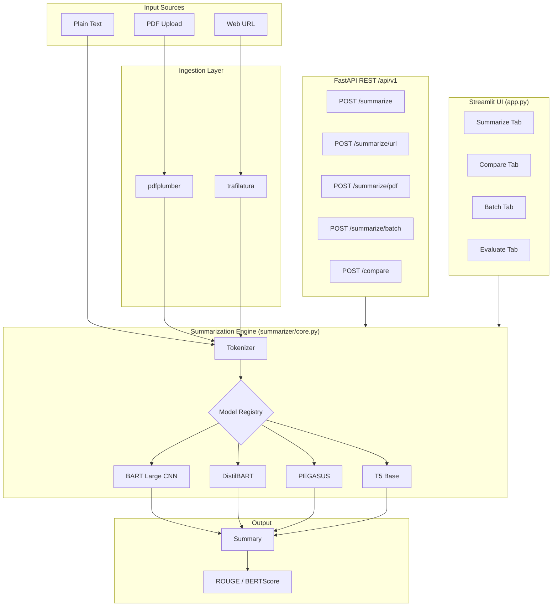

# 🔬 Advanced Text Summarization

[](https://github.com/Karthik0809/Text-Summarization-Using-BART/actions)
[](https://www.python.org/)
[](LICENSE)
[](https://huggingface.co/spaces/karthikmulugu08/text-summarizer)
[](https://fastapi.tiangolo.com)
[](Dockerfile)

Production-grade abstractive text summarization engine supporting **BART**, **PEGASUS**, and **T5** with a FastAPI REST backend, multi-modal input (text / PDF / URL), real-time token streaming, model comparison, and a full evaluation dashboard — deployed to HuggingFace Spaces.

> **Live Demo →** [huggingface.co/spaces/karthikmulugu08/text-summarizer](https://huggingface.co/spaces/karthikmulugu08/text-summarizer)

---

## ✨ Key Features

| Feature | Details |
|---|---|
| **Multi-model** | BART Large, DistilBART, PEGASUS, T5 — switchable per request |
| **Multi-modal input** | Plain text · PDF upload (pdfplumber) · Web URL (trafilatura) |
| **Streaming** | Real-time token-by-token output via `TextIteratorStreamer` |
| **Model comparison** | Side-by-side diff with latency & compression metrics |
| **Batch processing** | Up to 20 texts at once; CSV upload + download |
| **Evaluation dashboard** | ROUGE-1/2/L/Lsum gauges + radar chart (Plotly) |
| **REST API** | FastAPI with Swagger UI, Pydantic v2 validation, CORS |
| **Fine-tuning** | `Seq2SeqTrainer` + early stopping + optional HF Hub push |
| **Docker** | Multi-stage Dockerfile; `docker-compose` for API + UI |
| **CI/CD** | GitHub Actions → pytest + ruff + auto-deploy to HF Spaces |

---

## 🏗️ Architecture



---

## 🚀 Quick Start

### Option 1 — Python (local)

```bash
git clone https://github.com/Karthik0809/Text-Summarization-Using-BART.git
cd Text-Summarization-Using-BART
pip install -r requirements.txt

# Launch Streamlit UI
streamlit run app.py

# Or launch FastAPI backend
uvicorn api.main:app --reload
# → http://localhost:8000/docs
```

### Option 2 — Docker Compose

```bash
docker-compose up --build
# Streamlit → http://localhost:8501
# FastAPI   → http://localhost:8000/docs
```

### Option 3 — HuggingFace Spaces

Click the **Live Demo** badge above — no setup required.

---

## 📡 REST API

Interactive Swagger docs available at `http://localhost:8000/docs`.

### Summarize text

```bash
curl -X POST http://localhost:8000/api/v1/summarize \
  -H "Content-Type: application/json" \
  -d '{
    "text": "Scientists discovered a method for carbon capture...",
    "model_id": "sshleifer/distilbart-cnn-12-6",
    "max_length": 150,
    "num_beams": 4
  }'
```

```json
{
  "summary": "Scientists discovered a new carbon capture method...",
  "model_id": "sshleifer/distilbart-cnn-12-6",
  "input_tokens": 128,
  "output_tokens": 24,
  "compression_ratio": 5.33,
  "latency_ms": 312.4
}
```

### Compare two models

```python
import requests

resp = requests.post("http://localhost:8000/api/v1/compare", json={
    "text": "Long article text...",
    "model_ids": ["sshleifer/distilbart-cnn-12-6", "facebook/bart-large-cnn"]
})
for model_id, result in resp.json()["results"].items():
    print(f"{model_id}: {result['summary'][:80]}...")
```

### All endpoints

| Method | Endpoint | Description |
|--------|----------|-------------|
| `GET` | `/api/v1/health` | CUDA status + loaded models |
| `GET` | `/api/v1/models` | List available models |
| `POST` | `/api/v1/summarize` | Summarize plain text |
| `POST` | `/api/v1/summarize/url` | Fetch + summarize a URL |
| `POST` | `/api/v1/summarize/pdf` | Upload + summarize a PDF |
| `POST` | `/api/v1/summarize/batch` | Batch (up to 20 texts) |
| `POST` | `/api/v1/compare` | Multi-model comparison |

---

## 📊 Model Benchmark (CNN/DailyMail test, 100 samples)

| Model | ROUGE-1 | ROUGE-2 | ROUGE-L | Latency (CPU) | Size |
|-------|---------|---------|---------|---------------|------|
| `facebook/bart-large-cnn` | **0.442** | **0.213** | **0.304** | ~4.2 s/sample | 1.6 GB |
| `sshleifer/distilbart-cnn-12-6` | 0.428 | 0.208 | 0.295 | ~2.1 s/sample | 306 MB |
| `google/pegasus-cnn_dailymail` | 0.437 | 0.209 | 0.301 | ~5.0 s/sample | 2.3 GB |
| `t5-base` | 0.371 | 0.155 | 0.265 | ~1.8 s/sample | 892 MB |

> Evaluated with `python training/evaluate.py --model_id <id> --n_samples 100`

---

## 🧑‍🏫 Fine-tuning

```bash
# Fine-tune DistilBART on 10k CNN/DM samples (3 epochs, mixed precision)
python training/train.py \
  --model_id sshleifer/distilbart-cnn-12-6 \
  --train_samples 10000 \
  --eval_samples 1000 \
  --epochs 3 \
  --batch_size 4 \
  --grad_accum 4 \
  --fp16

# Push fine-tuned model to HuggingFace Hub
python training/train.py \
  --model_id sshleifer/distilbart-cnn-12-6 \
  --push_to_hub \
  --hub_model_id YOUR_USERNAME/my-distilbart-summarizer
```

Training features:
- `Seq2SeqTrainer` with `predict_with_generate`
- Early stopping (patience = 2 epochs)
- ROUGE-L as best-model metric
- Gradient accumulation for larger effective batch sizes

---

## 📁 Project Structure

```
├── app.py                    # Streamlit UI (HF Spaces entry point)
├── summarizer/               # Core package
│   ├── core.py               # Multi-model engine + streaming
│   ├── ingestion.py          # PDF (pdfplumber) + URL (trafilatura)
│   ├── evaluation.py         # ROUGE + BERTScore metrics
│   └── config.py             # pydantic-settings configuration
├── api/                      # FastAPI backend
│   ├── main.py               # App + middleware
│   ├── routes.py             # All endpoints
│   └── schemas.py            # Pydantic v2 request/response models
├── training/
│   ├── train.py              # Fine-tuning with Seq2SeqTrainer
│   └── evaluate.py           # Standalone ROUGE evaluation script
├── tests/
│   ├── test_api.py           # Endpoint tests (mocked engine)
│   └── test_core.py          # Unit tests for ingestion + evaluation
├── .github/workflows/
│   ├── ci.yml                # pytest + ruff on Python 3.10 & 3.11
│   └── deploy.yml            # Auto-deploy to HuggingFace Spaces
├── Dockerfile                # Multi-stage (api / app targets)
├── docker-compose.yml        # API + UI services
├── pyproject.toml            # Modern Python packaging + tool config
└── Makefile                  # Convenience targets
```

---

## 🔧 Development

```bash
# Install dev dependencies
make dev

# Run tests
make test

# Lint
make lint

# Start API + watch for changes
make api

# Start Streamlit
make app
```

---

## 🚢 Deploy to HuggingFace Spaces

1. Create a Space at [huggingface.co/new-space](https://huggingface.co/new-space) (SDK: Streamlit)
2. Add secrets to your GitHub repo:
   - `HF_TOKEN` — your HuggingFace write token
   - `HF_USERNAME` — your HuggingFace username
3. Push to `main` → GitHub Actions auto-deploys

---

## ✍️ Author

**Karthik Mulugu**
[GitHub](https://github.com/Karthik0809) · [LinkedIn](https://www.linkedin.com/in/karthikmulugu/)

---

## 📄 License

MIT License — see [LICENSE](LICENSE) for details.
